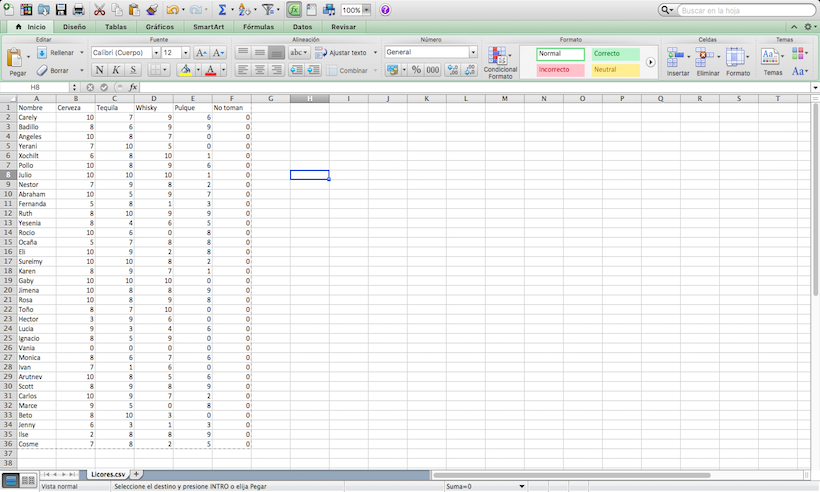
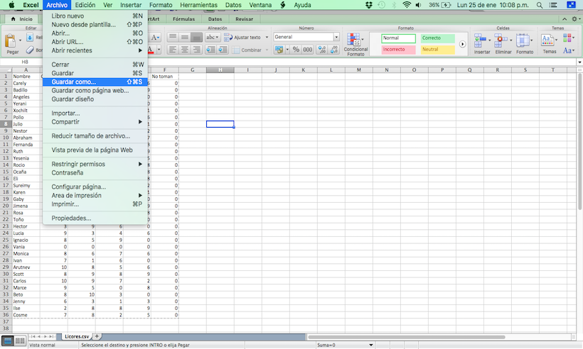
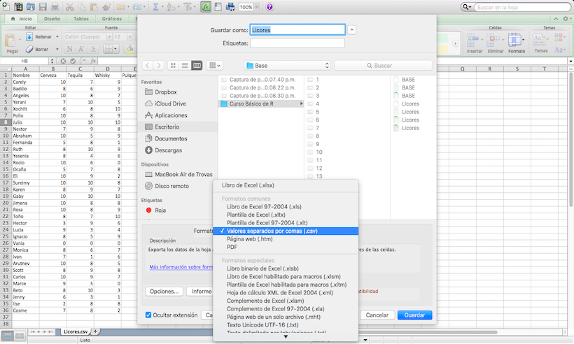
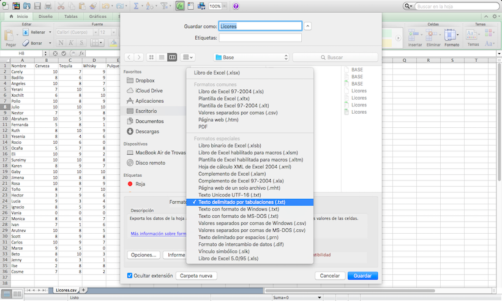
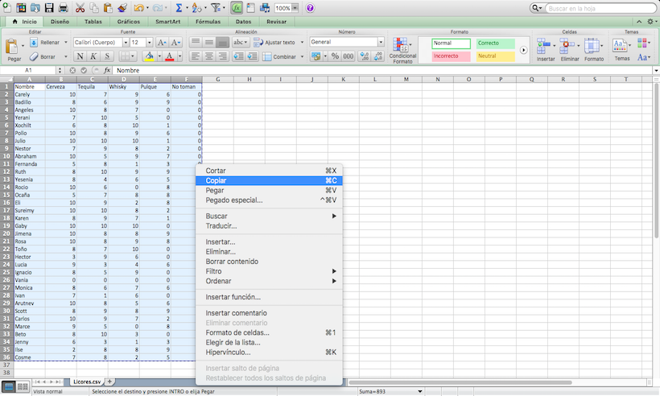

Importación de datos
====================

##Importación de datos



##Importación de datos



##Importación de datos



##Importación de datos

```{r comment=""}
base <- read.csv(
"~/Dropbox/Codigos en R/UAM/Primer Taller de estudiantes UAM-I y  Usuarios  de R-2018/2.-Manipulacion de Base de Datos/Bases de Ejemplos/Base 1 de Ejemplo(Ranavirus).csv")
```

##Importación de datos

```{r comment=""}
base <- read.csv(
"~/Dropbox/Codigos en R/UAM/Primer Taller de estudiantes UAM-I y  Usuarios  de R-2018/2.-Manipulacion de Base de Datos/Bases de Ejemplos/Base 1 de Ejemplo(Ranavirus).csv")
```

```{r comment="", eval=FALSE}
head(base)
```

##Importación de datos

```{r comment=""}
base <- read.csv(
"~/Dropbox/Codigos en R/UAM/Primer Taller de estudiantes UAM-I y  Usuarios  de R-2018/2.-Manipulacion de Base de Datos/Bases de Ejemplos/Base 1 de Ejemplo(Ranavirus).csv")
```

```{r comment=""}
head(base)
```

##Importación de datos



##Importación de datos

```{r comment=""}
base <- read.delim(
"~/Dropbox/Codigos en R/UAM/Primer Taller de estudiantes UAM-I y  Usuarios  de R-2018/2.-Manipulacion de Base de Datos/Bases de Ejemplos/Base 1 de Ejemplo(Ranavirus).txt")
```

##Importación de datos

```{r comment=""}
base <- read.delim(
"~/Dropbox/Codigos en R/UAM/Primer Taller de estudiantes UAM-I y  Usuarios  de R-2018/2.-Manipulacion de Base de Datos/Bases de Ejemplos/Base 1 de Ejemplo(Ranavirus).txt")
```

```{r comment=""}
head(base, n = 8)
```

##Importación de datos



##Importación de datos

```{r comment="", eval=FALSE}
base <- read.delim(file = "clipboard")
```

##Importación de datos

```{r comment="", eval=FALSE}
base <- read.delim(file = "clipboard")
```

```{r comment="", eval=FALSE}
base <- read.delim(file = pipe("pbpaste"))
```

##Importación de datos

```{r comment="", eval=FALSE}
base <- read.delim(file = "clipboard")
```

```{r comment="", eval= FALSE}
base <- read.delim(file = pipe("pbpaste"))
```

```{r comment=""}
head(base, n = 4)
```

##Importación de datos

#Desde R-Studio

##Funciones y operaciones básicas

```{r comment=""}
rm(list = ls())
```

##Funciones y operaciones básicas

```{r comment=""}
rm(list = ls())
```

```{r comment=""}
dat1 <- data.frame(Nombres = c("Lucia", "Ernesto", "Sofia", "Eduardo")
        , Edades = c(19, 23, 34, 43))
```

##Funciones y operaciones básicas

```{r comment=""}
rm(list = ls())
```

```{r comment=""}
dat1 <- data.frame(Nombres = c("Lucia", "Ernesto", "Sofia", "Eduardo")
        , Edades = c(19, 23, 34, 43))
```

```{r comment=""}
dat2 <- data.frame(Estatura = c(1.73, 1.50, 1.45, 1.80), 
        Peso = c(73, 80, 56, 84))
```

##Funciones y operaciones básicas

```{r comment=""}
rm(list = ls())
```

```{r comment=""}
dat1 <- data.frame(Nombres = c("Lucia", "Ernesto", "Sofia", "Eduardo")
        , Edades = c(19, 23, 34, 43))
```

```{r comment=""}
dat2 <- data.frame(Estatura = c(1.73, 1.50, 1.45, 1.80), 
        Peso = c(73, 80, 56, 84))
```

```{r comment=""}
dat3 <- data.frame(dat1, dat2)
```

##Funciones y operaciones básicas

```{r comment=""}
dat1; dat2
```

##Funciones y operaciones básicas

```{r comment=""}
dat3
```

##Funciones y operaciones básicas

```{r comment=""}
dat3
```

```{r comment=""}
dat4 <- data.frame(Nombres = "Gabriela", Edades = 23, Estatura = 1.63
                   , Peso = 67)
```

##Funciones y operaciones básicas

```{r comment=""}
dat3
```

```{r comment=""}
dat4 <- data.frame(Nombres = "Gabriela", Edades = 23, Estatura = 1.63
                   , Peso = 67)
```

```{r comment=""}
dat5 <- rbind(dat3, dat4)
```

##Funciones y operaciones básicas

```{r comment=""}
dat5
```

##Funciones y operaciones básicas

```{r comment=""}
dat5
```

```{r comment=""}
dat6 <- data.frame(Escolaridad = c("Preparatoria", "Universidad",
                     "Secundaria", "Universidad", "Universidad"))
```

##Funciones y operaciones básicas

```{r comment=""}
dat5
```

```{r comment=""}
dat6 <- data.frame(Escolaridad = c("Preparatoria", "Universidad",
                     "Secundaria", "Universidad", "Universidad"))
```

```{r comment=""}
dat5 <- cbind(dat5, dat6)
```

##Funciones y operaciones básicas

```{r comment=""}
dat5
```

##Funciones y operaciones básicas

```{r comment=""}
dat5
```

```{r comment=""}
dat5[2, 4]
```

##Funciones y operaciones básicas

```{r comment=""}
dat5
```

```{r comment=""}
dat5[2, 4]
```

```{r comment=""}
dat5[2, 4] <- 81.3
```

##Funciones y operaciones básicas

```{r comment=""}
dat5
```

##Funciones y operaciones básicas

```{r comment=""}
dat5
```

```{r comment=""}
dat5$Estatura
```

##Funciones y operaciones básicas

```{r comment=""}
dat5
```

```{r comment=""}
dat5$Estatura
```

```{r comment=""}
sum(dat5$Estatura)
```

##Funciones y operaciones básicas

```{r comment=""}
prod(dat5$Edades)
```

##Funciones y operaciones básicas

```{r comment=""}
prod(dat5$Edades)
```

```{r comment=""}
sum(dat5$Peso)/5
```

##Funciones y operaciones básicas

```{r comment=""}
prod(dat5$Edades)
```

```{r comment=""}
sum(dat5$Peso)/5
```

```{r comment=""}
mean(dat5$Peso)
```

##Funciones y operaciones básicas

```{r comment=""}
(media <- mean(dat5$Estatura))
```

##Funciones y operaciones básicas

```{r comment=""}
(media <- mean(dat5$Estatura))
```

```{r comment=""}
sum((dat5$Estatura-media)^2)/4
```

##Funciones y operaciones básicas

```{r comment=""}
(media <- mean(dat5$Estatura))
```

```{r comment=""}
sum((dat5$Estatura-media)^2)/4
```

```{r comment=""}
sqrt(sum((dat5$Estatura-media)^2)/4)
```

##Funciones y operaciones básicas

```{r comment=""}
var(dat5$Estatura)
```

##Funciones y operaciones básicas

```{r comment=""}
var(dat5$Estatura)
```

```{r comment=""}
sd(dat5$Estatura)
```

##Funciones y operaciones básicas

```{r comment=""}
var(dat5$Estatura)
```

```{r comment=""}
sd(dat5$Estatura)
```

```{r comment=""}
(dat5$Peso[3])
```

##Funciones y operaciones básicas

```{r comment=""}
var(dat5$Estatura)
```

```{r comment=""}
sd(dat5$Estatura)
```

```{r comment=""}
(dat5$Peso[3])
```

```{r comment=""}
median(dat5$Peso)
```

##Funciones y operaciones básicas

```{r comment=""}
dat5
```

##Funciones y operaciones básicas

```{r comment=""}
dat5
```

```{r comment=""}
sort(dat5$Peso)
```

##Funciones y operaciones básicas

```{r comment=""}
dat5
```

```{r comment=""}
sort(dat5$Peso)
```

```{r comment=""}
(dat5$Peso[1])
```

##Funciones y operaciones básicas

```{r comment=""}
dat5
```

##Funciones y operaciones básicas

```{r comment=""}
dat5
```

```{r comment=""}
max(dat5$Edades)
```

##Funciones y operaciones básicas

```{r comment=""}
dat5
```

```{r comment=""}
max(dat5$Edades)
```

```{r comment=""}
min(dat5$Edades)
```

##Funciones y operaciones básicas

```{r comment=""}
dat5
```

```{r comment=""}
range(dat5$Edades)
```

##Funciones y operaciones básicas


##Funciones y operaciones básicas

```{r comment=""}
dat5
```

```{r comment=""}
which(dat5$Escolaridad == "Universidad")
```

##Funciones y operaciones básicas

```{r comment=""}
dat5
```

```{r comment=""}
which(dat5$Escolaridad == "Universidad")
```

```{r comment=""}
which(dat5$Escolaridad != "Universidad")
```

##Funciones y operaciones básicas

```{r comment=""}
dat5
```

```{r comment=""}
which(dat5$Edades < 34)
```

```{r comment=""}
which(dat5$Edades <= 34)
```

##Funciones y operaciones básicas

```{r comment=""}
summary(dat5)
```


## R Markdown

This is an R Markdown presentation. Markdown is a simple formatting syntax for authoring HTML, PDF, and MS Word documents. For more details on using R Markdown see <http://rmarkdown.rstudio.com>.

When you click the **Knit** button a document will be generated that includes both content as well as the output of any embedded R code chunks within the document.


# Muchas gracias por su atención y a practicar R.